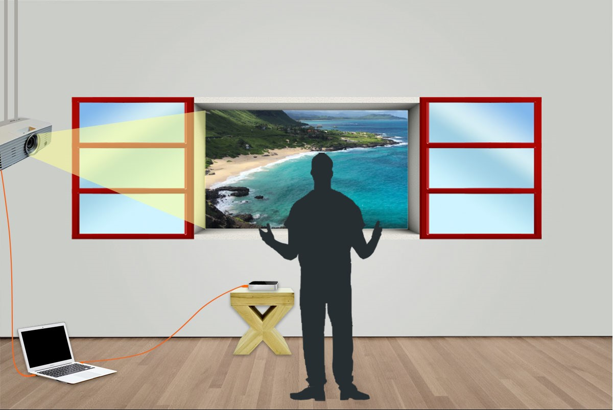
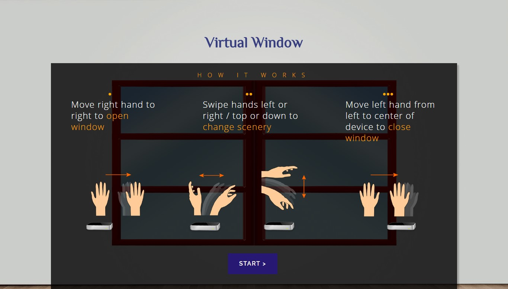
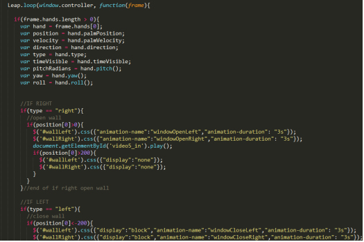
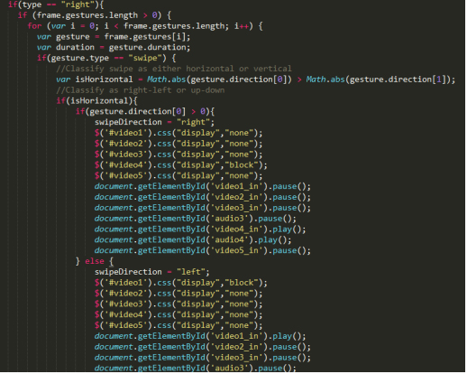

# VirtualWindow
This tutorial explains how to create a Virtual Window using Leap Motion. You can create a virtual window on your wall by just waving your hand. The Virtual Window can show you a warm sunny beach on a cold gloomy day or take you to your favourite vacation destination while you soak in the sights and sounds of a virtual vacation. 
https://www.youtube.com/watch?v=JYHSoRM1TNE

<h1>Introduction</h1>
We wanted to create this project using gesture recognition technology. Gesture recognition is a rapidly growing technology and enables humans to communicate with machines and interact naturally without using any mechanical devices. We made use of different gestures like swipe, move hand to left or right to control various events like open the window, change the scenery, or close the window.  

The gesture recognition was made using “Leap Motion”. Once it recognises a hand gesture, it will send a signal to the projector which will then display a virtual window on the wall. We also added various sound effects to the scenery, like the sound of beach waves, birds chirping, etc. If you want to change the scenery all you have to do is swipe your hand over the Leap Motion sensor.  

<h1>The Connection</h1>
The Leap Motion is placed near the wall and is connected to the computer, and the computer is connected to a projector. The Leap Motion recognizes the hand gestures over it and javascript events are handled according to the gestures. The final display is then projected on the wall through the projector. 

The Leap Motion Controller recognizes four different gestures for opening the window, changing the scenery and closing the window: 

<h1>The Code</h1>
<ul>
<li>Download the Leap Motion software and install the package: https://www.leapmotion.com/setup/desktop/windows</li>
<li>Create an HTML page with the window graphic, videos and audios.</li>
<li>Add a link to the leap.js file in the head tag.</li>
</ul>

The gestures were coded using Javascript and CSS animations and div changes were applied using JQuery.

First, there was a loop created to recognise if the hand was left or right:

We hope that everyone will have an enjoyable experience using our Virtual Window! 
